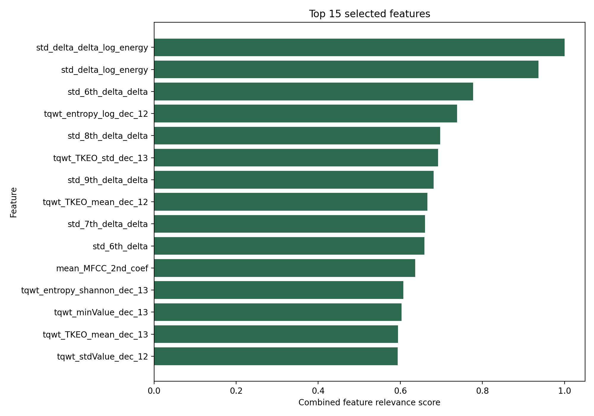
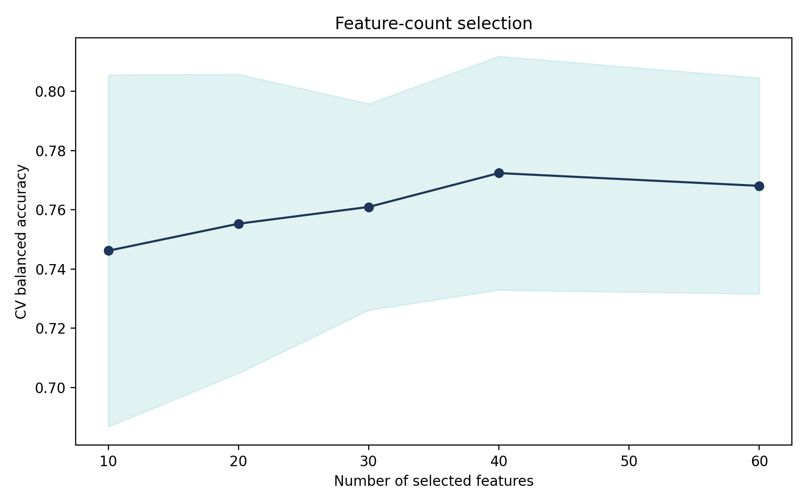
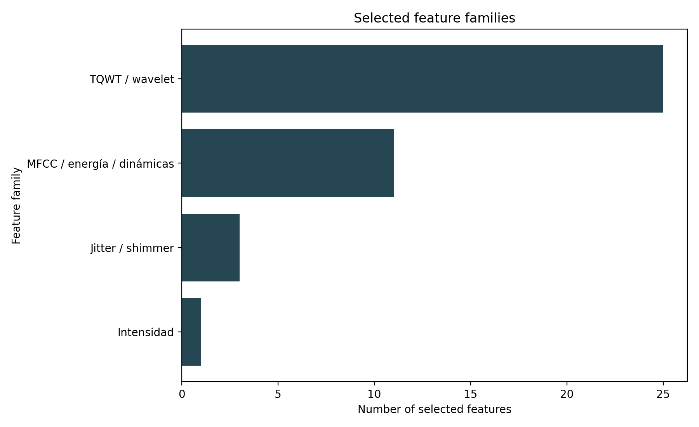
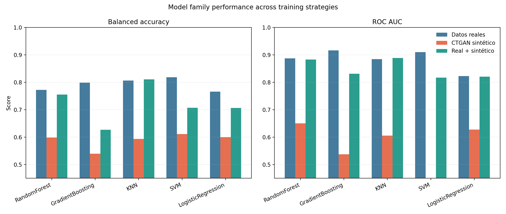
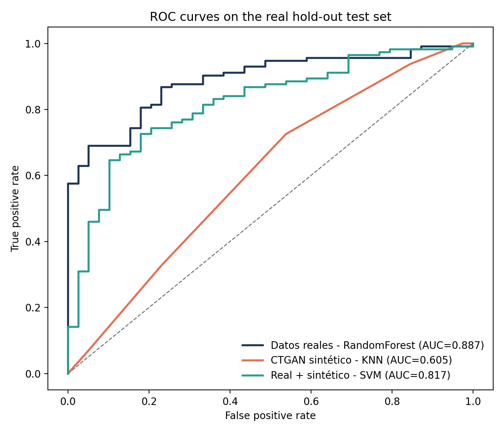
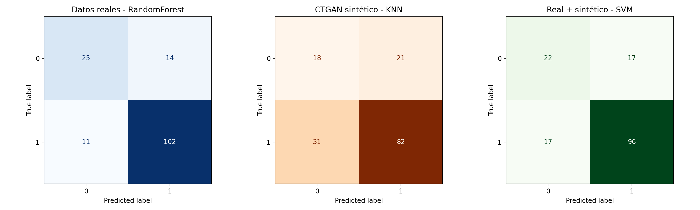
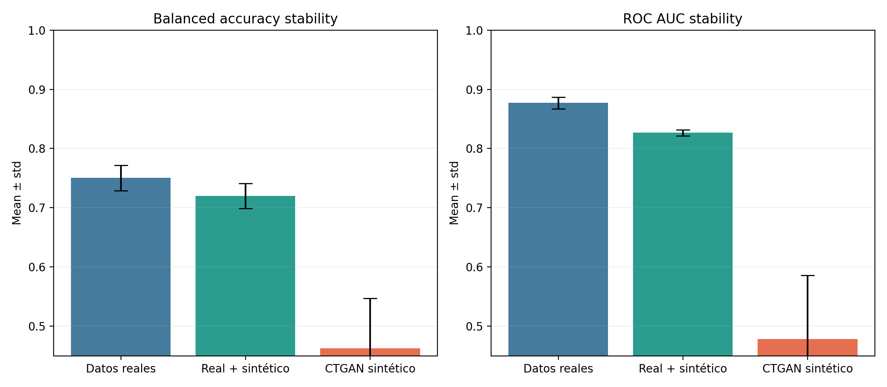
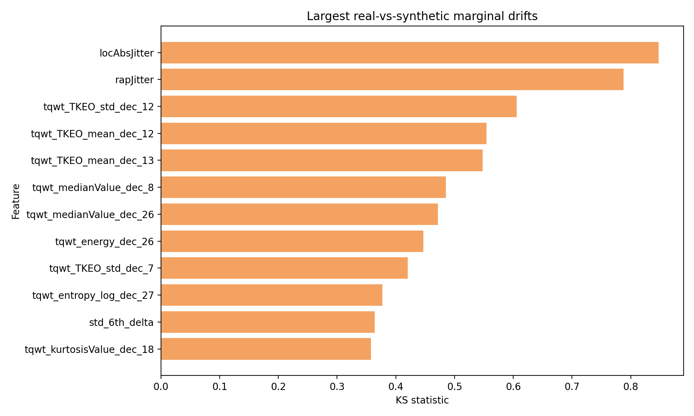

# Parkinson voice classification analysis

## Dataset summary

- Samples: 756
- Predictive variables after removing `id`: 753
- Target distribution: class 1 = 564, class 0 = 192
- Final hold-out split: 604 train / 152 test

## Methodology

1. A stratified train/test split was created before any feature selection or model fitting.
2. Feature relevance was ranked on the real training split using a combined score: mutual information + RandomForest importance.
3. The number of retained features was chosen with 5-fold CV and balanced accuracy.
4. Five classical models were tuned on the reduced feature space.
5. CTGAN was then fitted only on the selected features of the training split plus the target, and a purely synthetic training set with the same class counts was generated.
6. A third mixed strategy was added by concatenating real and synthetic training rows.
7. A lightweight robustness analysis repeated the selected strategies across seeds [13, 42].

## Selected feature subset

- Selected feature count: 40
- Selected features: std_delta_delta_log_energy, std_delta_log_energy, std_6th_delta_delta, tqwt_entropy_log_dec_12, std_8th_delta_delta, tqwt_TKEO_std_dec_13, std_9th_delta_delta, tqwt_TKEO_mean_dec_12, std_7th_delta_delta, std_6th_delta, mean_MFCC_2nd_coef, tqwt_entropy_shannon_dec_13, tqwt_minValue_dec_13, tqwt_TKEO_mean_dec_13, tqwt_stdValue_dec_12, rapJitter, std_8th_delta, tqwt_entropy_log_dec_16, tqwt_entropy_log_dec_13, tqwt_entropy_log_dec_35, tqwt_stdValue_dec_13, tqwt_TKEO_std_dec_12, tqwt_energy_dec_27, std_7th_delta, minIntensity, tqwt_energy_dec_26, tqwt_kurtosisValue_dec_18, apq11Shimmer, tqwt_entropy_log_dec_11, tqwt_maxValue_dec_12, tqwt_entropy_shannon_dec_12, std_10th_delta_delta, tqwt_medianValue_dec_8, tqwt_entropy_shannon_dec_14, tqwt_TKEO_mean_dec_16, tqwt_medianValue_dec_26, tqwt_entropy_log_dec_27, tqwt_TKEO_std_dec_7, tqwt_stdValue_dec_15, locAbsJitter
- Dominant family: TQWT / wavelet

### Family-level interpretation

The selected variables are not random column names: they form coherent acoustic families. TQWT descriptors dominate the subset, which suggests that multi-scale irregularities in the voice carry strong information about Parkinson-related degradation. MFCC and dynamic-energy features contribute complementary spectral and temporal structure, while jitter/shimmer variables capture cycle-to-cycle instability in phonation. Intensity appears less often, but it still adds a global energetic cue.

| family                     |   count |   share |   mean_combined_score | description                                                                                                                                          | features                                                                                                                                                                                                                                                                                                                                                                                                                                                                                                                                                                                                            |
|:---------------------------|--------:|--------:|----------------------:|:-----------------------------------------------------------------------------------------------------------------------------------------------------|:--------------------------------------------------------------------------------------------------------------------------------------------------------------------------------------------------------------------------------------------------------------------------------------------------------------------------------------------------------------------------------------------------------------------------------------------------------------------------------------------------------------------------------------------------------------------------------------------------------------------|
| TQWT / wavelet             |      25 |   0.625 |                0.5501 | Describe patrones multiescala en la voz; captura irregularidades temporales y espectrales que suelen aparecer cuando la fonación pierde estabilidad. | tqwt_entropy_log_dec_12, tqwt_TKEO_std_dec_13, tqwt_TKEO_mean_dec_12, tqwt_entropy_shannon_dec_13, tqwt_minValue_dec_13, tqwt_TKEO_mean_dec_13, tqwt_stdValue_dec_12, tqwt_entropy_log_dec_16, tqwt_entropy_log_dec_13, tqwt_entropy_log_dec_35, tqwt_stdValue_dec_13, tqwt_TKEO_std_dec_12, tqwt_energy_dec_27, tqwt_energy_dec_26, tqwt_kurtosisValue_dec_18, tqwt_entropy_log_dec_11, tqwt_maxValue_dec_12, tqwt_entropy_shannon_dec_12, tqwt_medianValue_dec_8, tqwt_entropy_shannon_dec_14, tqwt_TKEO_mean_dec_16, tqwt_medianValue_dec_26, tqwt_entropy_log_dec_27, tqwt_TKEO_std_dec_7, tqwt_stdValue_dec_15 |
| MFCC / energía / dinámicas |      11 |   0.275 |                0.6981 | Resume la envolvente espectral y su evolución temporal; refleja cambios finos en timbre, articulación y control motor de la voz.                     | std_delta_delta_log_energy, std_delta_log_energy, std_6th_delta_delta, std_8th_delta_delta, std_9th_delta_delta, std_7th_delta_delta, std_6th_delta, mean_MFCC_2nd_coef, std_8th_delta, std_7th_delta, std_10th_delta_delta                                                                                                                                                                                                                                                                                                                                                                                         |
| Jitter / shimmer           |       3 |   0.075 |                0.5221 | Mide microvariaciones ciclo a ciclo en frecuencia y amplitud; se asocia con inestabilidad de los pliegues vocales.                                   | rapJitter, apq11Shimmer, locAbsJitter                                                                                                                                                                                                                                                                                                                                                                                                                                                                                                                                                                               |
| Intensidad                 |       1 |   0.025 |                0.5478 | Caracteriza la energía y la proyección de la señal, útil para detectar alteraciones globales en la emisión vocal.                                    | minIntensity                                                                                                                                                                                                                                                                                                                                                                                                                                                                                                                                                                                                        |

## Real-data strategy

- CV-selected model: RandomForest
- Best hold-out model by balanced accuracy: SVM
- Hold-out balanced accuracy: 0.7718
- Hold-out sensitivity: 0.9027
- Hold-out specificity: 0.6410
- Hold-out F1: 0.8908
- Hold-out ROC AUC: 0.8870

| strategy   | model              |   cv_balanced_accuracy_mean |   cv_balanced_accuracy_std |   cv_f1_mean |   cv_roc_auc_mean |   test_accuracy |   test_balanced_accuracy |   test_precision |   test_sensitivity |   test_specificity |   test_f1 |   test_roc_auc | best_params                                                                        |
|:-----------|:-------------------|----------------------------:|---------------------------:|-------------:|------------------:|----------------:|-------------------------:|-----------------:|-------------------:|-------------------:|----------:|---------------:|:-----------------------------------------------------------------------------------|
| real       | RandomForest       |                      0.8049 |                     0.0469 |       0.9145 |            0.9071 |          0.8355 |                   0.7718 |           0.8793 |             0.9027 |             0.641  |    0.8908 |         0.887  | {"max_depth": 12, "max_features": 0.3, "min_samples_leaf": 4, "n_estimators": 300} |
| real       | GradientBoosting   |                      0.8038 |                     0.0272 |       0.9183 |            0.9062 |          0.875  |                   0.7984 |           0.8852 |             0.9558 |             0.641  |    0.9191 |         0.916  | {"learning_rate": 0.1, "max_depth": 3, "n_estimators": 200}                        |
| real       | KNN                |                      0.7959 |                     0.0292 |       0.9126 |            0.8656 |          0.8487 |                   0.8059 |           0.9018 |             0.8938 |             0.7179 |    0.8978 |         0.8845 | {"model__n_neighbors": 3, "model__p": 1, "model__weights": "uniform"}              |
| real       | SVM                |                      0.7866 |                     0.0232 |       0.8757 |            0.8943 |          0.8421 |                   0.8182 |           0.9159 |             0.8673 |             0.7692 |    0.8909 |         0.9099 | {"model__C": 3.0, "model__gamma": "scale", "model__kernel": "rbf"}                 |
| real       | LogisticRegression |                      0.7776 |                     0.0309 |       0.8505 |            0.8779 |          0.7763 |                   0.7656 |           0.899  |             0.7876 |             0.7436 |    0.8396 |         0.8223 | {"model__C": 0.1}                                                                  |

## CTGAN synthetic-data strategy

- CTGAN epochs: 50
- CV-selected model: KNN
- Best hold-out model by balanced accuracy: SVM
- Hold-out balanced accuracy: 0.5936
- Hold-out sensitivity: 0.7257
- Hold-out specificity: 0.4615
- Hold-out F1: 0.7593
- Hold-out ROC AUC: 0.6054

| strategy   | model              |   cv_balanced_accuracy_mean |   cv_balanced_accuracy_std |   cv_f1_mean |   cv_roc_auc_mean |   test_accuracy |   test_balanced_accuracy |   test_precision |   test_sensitivity |   test_specificity |   test_f1 |   test_roc_auc | best_params                                                                           |
|:-----------|:-------------------|----------------------------:|---------------------------:|-------------:|------------------:|----------------:|-------------------------:|-----------------:|-------------------:|-------------------:|----------:|---------------:|:--------------------------------------------------------------------------------------|
| synthetic  | KNN                |                      0.5317 |                     0.0346 |       0.6378 |            0.5371 |          0.6579 |                   0.5936 |           0.7961 |             0.7257 |             0.4615 |    0.7593 |         0.6054 | {"model__n_neighbors": 5, "model__p": 1, "model__weights": "uniform"}                 |
| synthetic  | RandomForest       |                      0.5126 |                     0.0114 |       0.6733 |            0.5115 |          0.6776 |                   0.5985 |           0.7963 |             0.7611 |             0.4359 |    0.7783 |         0.6506 | {"max_depth": 12, "max_features": "sqrt", "min_samples_leaf": 4, "n_estimators": 500} |
| synthetic  | SVM                |                      0.508  |                     0.0227 |       0.5843 |            0.5042 |          0.5592 |                   0.6112 |           0.8382 |             0.5044 |             0.7179 |    0.6298 |         0.3749 | {"model__C": 1.0, "model__gamma": 0.01, "model__kernel": "rbf"}                       |
| synthetic  | GradientBoosting   |                      0.5009 |                     0.0585 |       0.6226 |            0.4916 |          0.5526 |                   0.5396 |           0.7711 |             0.5664 |             0.5128 |    0.6531 |         0.5373 | {"learning_rate": 0.1, "max_depth": 2, "n_estimators": 200}                           |
| synthetic  | LogisticRegression |                      0.4933 |                     0.0328 |       0.5591 |            0.485  |          0.5921 |                   0.5997 |           0.8148 |             0.5841 |             0.6154 |    0.6804 |         0.6274 | {"model__C": 0.1}                                                                     |

## Mixed real + CTGAN strategy

- CV-selected model: SVM
- Best hold-out model by balanced accuracy: KNN
- Hold-out balanced accuracy: 0.7068
- Hold-out sensitivity: 0.8496
- Hold-out specificity: 0.5641
- Hold-out F1: 0.8496
- Hold-out ROC AUC: 0.8169

| strategy   | model              |   cv_balanced_accuracy_mean |   cv_balanced_accuracy_std |   cv_f1_mean |   cv_roc_auc_mean |   test_accuracy |   test_balanced_accuracy |   test_precision |   test_sensitivity |   test_specificity |   test_f1 |   test_roc_auc | best_params                                                                        |
|:-----------|:-------------------|----------------------------:|---------------------------:|-------------:|------------------:|----------------:|-------------------------:|-----------------:|-------------------:|-------------------:|----------:|---------------:|:-----------------------------------------------------------------------------------|
| mixed      | SVM                |                      0.6684 |                     0.0164 |       0.666  |            0.723  |          0.7763 |                   0.7068 |           0.8496 |             0.8496 |             0.5641 |    0.8496 |         0.8169 | {"model__C": 0.5, "model__gamma": "scale", "model__kernel": "rbf"}                 |
| mixed      | RandomForest       |                      0.6437 |                     0.0241 |       0.7911 |            0.7568 |          0.8355 |                   0.755  |           0.8667 |             0.9204 |             0.5897 |    0.8927 |         0.8829 | {"max_depth": 12, "max_features": 0.3, "min_samples_leaf": 4, "n_estimators": 500} |
| mixed      | LogisticRegression |                      0.6336 |                     0.0174 |       0.6953 |            0.7125 |          0.7632 |                   0.7064 |           0.8532 |             0.823  |             0.5897 |    0.8378 |         0.8205 | {"model__C": 0.1}                                                                  |
| mixed      | KNN                |                      0.633  |                     0.0173 |       0.7799 |            0.6865 |          0.8553 |                   0.8103 |           0.9027 |             0.9027 |             0.7179 |    0.9027 |         0.8885 | {"model__n_neighbors": 3, "model__p": 1, "model__weights": "uniform"}              |
| mixed      | GradientBoosting   |                      0.6177 |                     0.0256 |       0.7776 |            0.7346 |          0.7697 |                   0.6268 |           0.8    |             0.9204 |             0.3333 |    0.856  |         0.8312 | {"learning_rate": 0.1, "max_depth": 2, "n_estimators": 200}                        |

## Comparison

- Balanced-accuracy gap (real - synthetic): 0.1782
- Sensitivity gap (real - synthetic): 0.1770
- F1 gap (real - synthetic): 0.1316
- ROC AUC gap (real - synthetic): 0.2816

The real-data strategy should still be treated as the deployment reference. The synthetic strategy is useful precisely because it underperforms: it shows that CTGAN preserves part of the signal but not enough to replace real clinical data. The mixed strategy answers the practical question that matters for the presentation: even when synthetic-only training is weaker, synthetic rows may still serve as an auxiliary experimental resource.

## Robustness across seeds

The table below repeats the CV-selected model family for each strategy over seeds [13, 42]. This is not a full nested re-tuning study; it is a stability check designed to estimate how much the conclusions move when the train/test split and CTGAN fitting are perturbed. For runtime reasons, CTGAN was retrained with 25 epochs in this robustness block.

| strategy   | model        |   accuracy_mean |   accuracy_std |   balanced_accuracy_mean |   balanced_accuracy_std |   precision_mean |   precision_std |   sensitivity_mean |   sensitivity_std |   specificity_mean |   specificity_std |   f1_mean |   f1_std |   roc_auc_mean |   roc_auc_std |
|:-----------|:-------------|----------------:|---------------:|-------------------------:|------------------------:|-----------------:|----------------:|-------------------:|------------------:|-------------------:|------------------:|----------:|---------:|---------------:|--------------:|
| real       | RandomForest |          0.8224 |         0.0132 |                   0.7504 |                  0.0214 |           0.8676 |          0.0117 |             0.8982 |            0.0044 |             0.6026 |            0.0385 |    0.8826 |   0.0082 |         0.8769 |        0.0101 |
| mixed      | SVM          |          0.7961 |         0.0066 |                   0.7201 |                  0.0212 |           0.8538 |          0.0135 |             0.8761 |            0.0088 |             0.5641 |            0.0513 |    0.8647 |   0.0026 |         0.8266 |        0.005  |
| synthetic  | KNN          |          0.5757 |         0.0625 |                   0.4627 |                  0.084  |           0.7237 |          0.0448 |             0.6947 |            0.0398 |             0.2308 |            0.1282 |    0.7089 |   0.0422 |         0.4781 |        0.1078 |

## Synthetic data quality

- Mean KS statistic across selected features: 0.3040
- Max KS statistic: 0.8477
- Mean normalized Wasserstein distance: 0.5976
- Correlation-matrix MAE: 0.3134

The drift values below indicate which selected variables are hardest for CTGAN to reproduce faithfully. They are the best candidates to discuss when explaining why the synthetic classifier may lose sensitivity.

| feature               |   ks_stat |   wasserstein_normalized |
|:----------------------|----------:|-------------------------:|
| locAbsJitter          |    0.8477 |                   1.3429 |
| rapJitter             |    0.7881 |                   0.3896 |
| tqwt_TKEO_std_dec_12  |    0.606  |                   0.0852 |
| tqwt_TKEO_mean_dec_12 |    0.5546 |                   0.136  |
| tqwt_TKEO_mean_dec_13 |    0.548  |                   0.2298 |

## Conclusion

The complete comparison is now reproducible from a single script. The mature interpretation is not that CTGAN "failed", but that it preserved only part of the clinically useful signal. In this dataset, the combination of limited sample size and very high-dimensional multiscale voice descriptors makes high-fidelity synthetic generation difficult. That weakness strengthens the oral defence: it shows that you are not overselling synthetic data, and that you understand where the method helps and where it does not replace real evidence.
